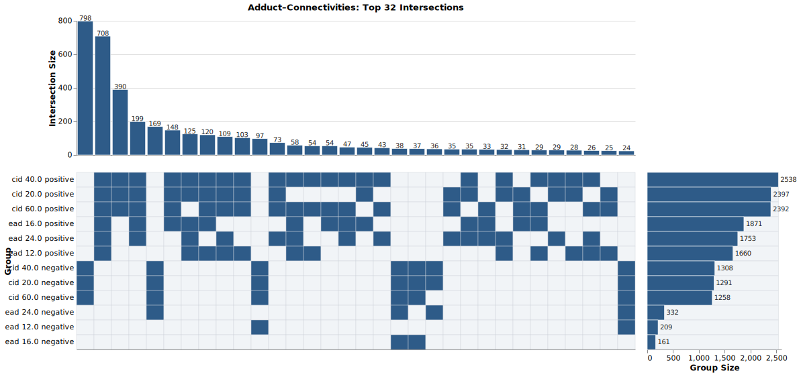
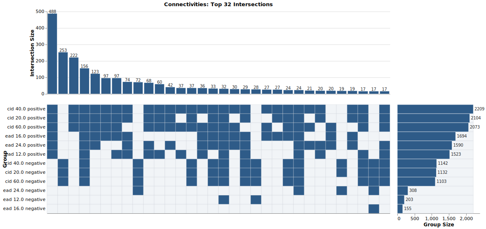
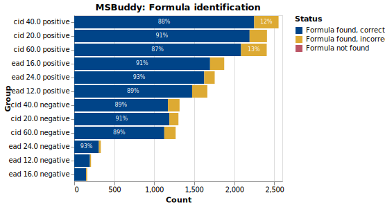
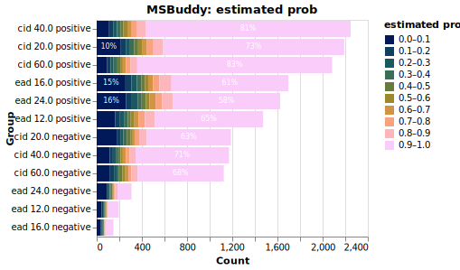
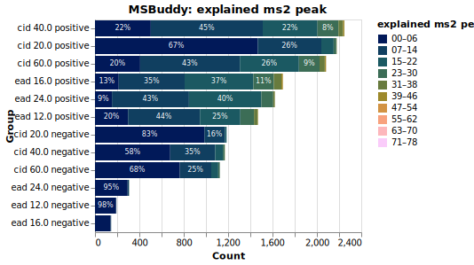
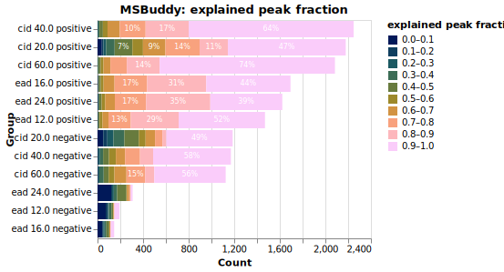
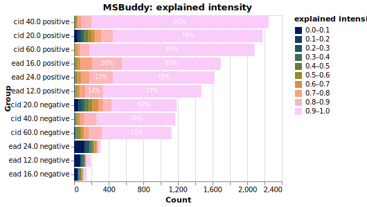

# MultiMS2: A Multi-Modal, Multi-Energy MS2 Spectral Library
## Overview

MultiMS2 is a curated mass spectrometry spectral library designed to address critical gaps in metabolomics research.
This library provides high-quality MS/MS spectra across:

- **Multiple fragmentation methods**: Collision-Induced Dissociation (CID) and Electron-Activated Dissociation (EAD)
- **Multiple collision energies**: 20, 40, and 60 eV for CID; 12, 16, and 24 eV for EAD
- **Both ionization modes**: Positive and negative

### Why MultiMS2?

Confident metabolite identification relies on high-quality reference spectral libraries, yet most existing resources suffer from significant limitations:

- **Limited fragmentation diversity**: Predominantly CID spectra, with EAD spectra remaining scarce despite their structural value
- **Restricted energy ranges**: Single or limited collision energy coverage
- **Narrow acquisition conditions**: Limited applicability across varied analytical workflows
- **Machine learning constraints**: Insufficient diversity for training robust, generalizable models

MultiMS2 addresses these challenges by providing a curated resource that:

- Enables reliable metabolite annotation across diverse experimental conditions
- Supports development of generalizable machine learning models for spectrum prediction and structure elucidation
- Facilitates comparative fragmentation studies between CID and EAD
- Accelerates innovation in computational metabolomics

## Data Availability

The complete dataset is publicly available through:

- **Zenodo**: [https://doi.org/10.5281/zenodo.17250693](https://doi.org/10.5281/zenodo.17250693)
- **MassIVE**: [https://doi.org/10.25345/C5GQ6RF85](https://doi.org/10.25345/C5GQ6RF85)

## Installation & Setup

### Prerequisites

- [mzmine 3+](https://mzmine.github.io/)
- [uv package manager](https://github.com/astral-sh/uv)
- [Docker](https://www.docker.com/) (for initial conversion only)

### Quick Start

1. **Clone the repository**

```bash
git clone https://github.com/yourusername/MultiMS2.git
cd MultiMS2
```

2. **Download spectral data from Zenodo**

```bash
uv run python notebooks/get_mzmls_from_zenodo.py
```

and then:

```bash
unzip "*.zip"
```

3. **Configure mzmine batch files**

Update the metadata file path in `.mzmine/batch/*.mzbatch`:

```xml
<parameter name="Database file">
    <current_file>/path/to/your/local/msmls_metadata_neg.tsv</current_file>
</parameter>
```

## Usage

### Spectral Extraction with mzmine[^1][^2]

The library generation uses mzmine batch processing for consistent, reproducible spectral extraction. Below are the commands for all library combinations:

#### NEXUS Library

**Negative Mode:**

```bash
# CID at different energies
mzmine -b ".mzmine/batch/nexus_library_generation_neg.mzbatch" \
  -i "scratch/nexus_mzml_centroided_neg_cid_20/*.mzML" \
  -o "scratch/nexus_neg_cid_20"

mzmine -b ".mzmine/batch/nexus_library_generation_neg.mzbatch" \
  -i "scratch/nexus_mzml_centroided_neg_cid_40/*.mzML" \
  -o "scratch/nexus_neg_cid_40"

mzmine -b ".mzmine/batch/nexus_library_generation_neg.mzbatch" \
  -i "scratch/nexus_mzml_centroided_neg_cid_60/*.mzML" \
  -o "scratch/nexus_neg_cid_60"

# EAD at different energies
mzmine -b ".mzmine/batch/nexus_library_generation_neg.mzbatch" \
  -i "scratch/nexus_mzml_centroided_neg_ead_12/*.mzML" \
  -o "scratch/nexus_neg_ead_12"

mzmine -b ".mzmine/batch/nexus_library_generation_neg.mzbatch" \
  -i "scratch/nexus_mzml_centroided_neg_ead_16/*.mzML" \
  -o "scratch/nexus_neg_ead_16"

mzmine -b ".mzmine/batch/nexus_library_generation_neg.mzbatch" \
  -i "scratch/nexus_mzml_centroided_neg_ead_24/*.mzML" \
  -o "scratch/nexus_neg_ead_24"
```

**Positive Mode:**

```bash
# CID at different energies
mzmine -b ".mzmine/batch/nexus_library_generation_pos.mzbatch" \
  -i "scratch/nexus_mzml_centroided_pos_cid_20/*.mzML" \
  -o "scratch/nexus_pos_cid_20"

mzmine -b ".mzmine/batch/nexus_library_generation_pos.mzbatch" \
  -i "scratch/nexus_mzml_centroided_pos_cid_40/*.mzML" \
  -o "scratch/nexus_pos_cid_40"

mzmine -b ".mzmine/batch/nexus_library_generation_pos.mzbatch" \
  -i "scratch/nexus_mzml_centroided_pos_cid_60/*.mzML" \
  -o "scratch/nexus_pos_cid_60"

# EAD at different energies
mzmine -b ".mzmine/batch/nexus_library_generation_pos.mzbatch" \
  -i "scratch/nexus_mzml_centroided_pos_ead_12/*.mzML" \
  -o "scratch/nexus_pos_ead_12"

mzmine -b ".mzmine/batch/nexus_library_generation_pos.mzbatch" \
  -i "scratch/nexus_mzml_centroided_pos_ead_16/*.mzML" \
  -o "scratch/nexus_pos_ead_16"

mzmine -b ".mzmine/batch/nexus_library_generation_pos.mzbatch" \
  -i "scratch/nexus_mzml_centroided_pos_ead_24/*.mzML" \
  -o "scratch/nexus_pos_ead_24"
```

#### Selleck Library

**Negative Mode:**

```bash
# CID energies
mzmine -b ".mzmine/batch/selleck_library_generation_neg.mzbatch" \
  -i "scratch/selleck_mzml_centroided_neg_cid_20/*.mzML" \
  -o "scratch/selleck_neg_cid_20"

mzmine -b ".mzmine/batch/selleck_library_generation_neg.mzbatch" \
  -i "scratch/selleck_mzml_centroided_neg_cid_40/*.mzML" \
  -o "scratch/selleck_neg_cid_40"

mzmine -b ".mzmine/batch/selleck_library_generation_neg.mzbatch" \
  -i "scratch/selleck_mzml_centroided_neg_cid_60/*.mzML" \
  -o "scratch/selleck_neg_cid_60"

# EAD energies
mzmine -b ".mzmine/batch/selleck_library_generation_neg.mzbatch" \
  -i "scratch/selleck_mzml_centroided_neg_ead_12/*.mzML" \
  -o "scratch/selleck_neg_ead_12"

mzmine -b ".mzmine/batch/selleck_library_generation_neg.mzbatch" \
  -i "scratch/selleck_mzml_centroided_neg_ead_16/*.mzML" \
  -o "scratch/selleck_neg_ead_16"

mzmine -b ".mzmine/batch/selleck_library_generation_neg.mzbatch" \
  -i "scratch/selleck_mzml_centroided_neg_ead_24/*.mzML" \
  -o "scratch/selleck_neg_ead_24"
```

**Positive Mode:**

```bash
# CID energies
mzmine -b ".mzmine/batch/selleck_library_generation_pos.mzbatch" \
  -i "scratch/selleck_mzml_centroided_pos_cid_20/*.mzML" \
  -o "scratch/selleck_pos_cid_20"

mzmine -b ".mzmine/batch/selleck_library_generation_pos.mzbatch" \
  -i "scratch/selleck_mzml_centroided_pos_cid_40/*.mzML" \
  -o "scratch/selleck_pos_cid_40"

mzmine -b ".mzmine/batch/selleck_library_generation_pos.mzbatch" \
  -i "scratch/selleck_mzml_centroided_pos_cid_60/*.mzML" \
  -o "scratch/selleck_pos_cid_60"

# EAD energies
mzmine -b ".mzmine/batch/selleck_library_generation_pos.mzbatch" \
  -i "scratch/selleck_mzml_centroided_pos_ead_12/*.mzML" \
  -o "scratch/selleck_pos_ead_12"

mzmine -b ".mzmine/batch/selleck_library_generation_pos.mzbatch" \
  -i "scratch/selleck_mzml_centroided_pos_ead_16/*.mzML" \
  -o "scratch/selleck_pos_ead_16"

mzmine -b ".mzmine/batch/selleck_library_generation_pos.mzbatch" \
  -i "scratch/selleck_mzml_centroided_pos_ead_24/*.mzML" \
  -o "scratch/selleck_pos_ead_24"
```

#### MSMLS Library

**Negative Mode:**

```bash
# CID energies
mzmine -b ".mzmine/batch/msmls_library_generation_neg.mzbatch" \
  -i "scratch/msmls_mzml_centroided_neg_cid_20/*.mzML" \
  -o "scratch/msmls_neg_cid_20"

mzmine -b ".mzmine/batch/msmls_library_generation_neg.mzbatch" \
  -i "scratch/msmls_mzml_centroided_neg_cid_40/*.mzML" \
  -o "scratch/msmls_neg_cid_40"

mzmine -b ".mzmine/batch/msmls_library_generation_neg.mzbatch" \
  -i "scratch/msmls_mzml_centroided_neg_cid_60/*.mzML" \
  -o "scratch/msmls_neg_cid_60"

# EAD energies (note: 12 eV not available)
mzmine -b ".mzmine/batch/msmls_library_generation_neg.mzbatch" \
  -i "scratch/msmls_mzml_centroided_neg_ead_16/*.mzML" \
  -o "scratch/msmls_neg_ead_16"

mzmine -b ".mzmine/batch/msmls_library_generation_neg.mzbatch" \
  -i "scratch/msmls_mzml_centroided_neg_ead_24/*.mzML" \
  -o "scratch/msmls_neg_ead_24"
```

**Positive Mode:**

```bash
# CID energies (note: 20 eV not available)
mzmine -b ".mzmine/batch/msmls_library_generation_pos.mzbatch" \
  -i "scratch/msmls_mzml_centroided_pos_cid_40/*.mzML" \
  -o "scratch/msmls_pos_cid_40"

mzmine -b ".mzmine/batch/msmls_library_generation_pos.mzbatch" \
  -i "scratch/msmls_mzml_centroided_pos_cid_60/*.mzML" \
  -o "scratch/msmls_pos_cid_60"

# EAD energies (note: 12 eV not available)
mzmine -b ".mzmine/batch/msmls_library_generation_pos.mzbatch" \
  -i "scratch/msmls_mzml_centroided_pos_ead_16/*.mzML" \
  -o "scratch/msmls_pos_ead_16"

mzmine -b ".mzmine/batch/msmls_library_generation_pos.mzbatch" \
  -i "scratch/msmls_mzml_centroided_pos_ead_24/*.mzML" \
  -o "scratch/msmls_pos_ead_24"
```

**Performance Note:** For optimal performance, consider copying files to a fast local disk before processing to avoid slow network I/O.

### Quality Control and Validation

#### Metadata

Because of an issue during `.mzML` file conversion, `COLLISION_ENERGY` and `FRAGMENTATION_METHOD` are missing from negative CID files.
To fix it, run:

```bash
uv run python notebooks/edit_mgf_collision_fragmentation.py /Users/adrutz/Git/MultiMS2/scratch/nexus_neg_cid_20_batch_library.mgf CID 20.0
uv run python notebooks/edit_mgf_collision_fragmentation.py /Users/adrutz/Git/MultiMS2/scratch/nexus_neg_cid_40_batch_library.mgf CID 40.0
uv run python notebooks/edit_mgf_collision_fragmentation.py /Users/adrutz/Git/MultiMS2/scratch/nexus_neg_cid_60_batch_library.mgf CID 60.0
uv run python notebooks/edit_mgf_collision_fragmentation.py /Users/adrutz/Git/MultiMS2/scratch/selleck_neg_cid_20_batch_library.mgf CID 20.0
uv run python notebooks/edit_mgf_collision_fragmentation.py /Users/adrutz/Git/MultiMS2/scratch/selleck_neg_cid_40_batch_library.mgf CID 40.0
uv run python notebooks/edit_mgf_collision_fragmentation.py /Users/adrutz/Git/MultiMS2/scratch/selleck_neg_cid_60_batch_library.mgf CID 60.0
uv run python notebooks/edit_mgf_collision_fragmentation.py /Users/adrutz/Git/MultiMS2/scratch/msmls_neg_cid_20_batch_library.mgf CID 20.0
uv run python notebooks/edit_mgf_collision_fragmentation.py /Users/adrutz/Git/MultiMS2/scratch/msmls_neg_cid_40_batch_library.mgf CID 40.0
uv run python notebooks/edit_mgf_collision_fragmentation.py /Users/adrutz/Git/MultiMS2/scratch/msmls_neg_cid_60_batch_library.mgf CID 60.0
```

#### Concatenation

```bash
uv run python notebooks/concatenate_spectra.py
```

#### Modalities and Quality Filtering

After this, spectra from all sub-libraries and modalities are concatenated by running:

```bash
uv run python notebooks/filter_spectra_consistent.py
```

Only the spectra complying to the following rules are kept:

```python
# Thresholds
min_precursor_height = 1000.0
min_precursor_purity = 0.9
min_signals = 3
min_explained_intensity = 0.4
min_explained_signals = 0.05
min_modalities = 2
min_intensity_ratio = 0.8
min_signals_ratio = 0.4
```

After charge consistency filter: 148888 spectra remain.
After min_precursor_height: 133624 spectra, 11998 unique (inchi_aux, adduct)
After min_precursor_purity: 128116 spectra, 11693 unique (inchi_aux, adduct)
After min_signals: 113652 spectra, 11346 unique (inchi_aux, adduct)
After min_explained_intensity: 67004 spectra, 9394 unique (inchi_aux, adduct)
After min_explained_signals: 66916 spectra, 9392 unique (inchi_aux, adduct)
After min_intensity_ratio: 61163 spectra, 9392 unique (inchi_aux, adduct)
After min_signals_ratio: 60359 spectra, 9392 unique (inchi_aux, adduct)
After min_explained_intensity: 60359 spectra, 9392 unique (inchi_aux, adduct)
After min_explained_signals: 60359 spectra, 9392 unique (inchi_aux, adduct)
After min_modalities per (inchi_aux, adduct): 3043 inchi_aux, 4563 unique (inchi_aux, adduct), 25126 unique (inchi_aux, adduct, modality)
Final spectra selected for output: 47630
Exported 47630 final spectra to scratch/filtered_spectra.mgf

(Both `all` and `filtered` MGF are exported)

#### Adduct Assignment Check

An additional check is performed to chemically validate numerically found adducts/losses.
In other words, if a spectrum was recognized as `[M-H2O+H]+`, it checks if the compound contains hydroxyls, and so on.
Checks are performed using RDKit[^3].

```bash
uv run python notebooks/validate_losses.py
```

From the 47,630 filtered spectra, 43,728 were validated and 3,902 discarded.

#### Metadata Consolidation

At this point, SELFIES[^4] can be added, metadata in the headers cleaned up, and unique feature IDs attributed using:

```bash
uv run python notebooks/consolidate_spectra.py --instrument_name ZENOTOF7600 --data_curator ARutz
```

#### MS-BUDDY[^5] Molecular Formula Annotation

MS-BUDDY provides molecular formula annotation to further structural validation:

```bash
uv run msbuddy \
-mgf "scratch/consolidated_spectra.mgf" \
-ms qtof \
-parallel \
-batch_size 100 \
-details \
-halogen \
-rel_int_denoise_cutoff 0 \
-top_n_per_50_da -1 \
-output "scratch/msbuddy"
```

## Visualization

```bash
uv run python notebooks/viz_upset.py
```





In the end:

* 2,899 unique compounds were recorded in 
  * 4,210 unique compound-adduct modalities,
    * 17,170 unique compound-adduct-fragmentation modalities for a total of 
      * 43,728 spectra

```bash
uv run python notebooks/viz_msbuddy.py
```












<!-- an additional TMAP visualization is also available:

```bash
uv run python notebooks/viz_tmap.py
``` -->

## GNPS[^6] export

To export the TSV file required for GNPS libraries:

```bash
uv run python notebooks/convert_spectra_to_tsv.py
```

This should then pass the validation at <https://gnps-quickstart.ucsd.edu/validatebatch>

## Data Processing Pipeline (here for reference)

### Initial Data Conversion

The following steps document the complete data processing workflow from raw instrument files to curated spectral libraries.

#### Step 1: Convert `.wiff` to `.mzML`

Raw AB SCIEX `.wiff` files are converted to open-format `.mzML` using ProteoWizard[^7]:

```bash
docker run -it --rm \
  -v .:/data \
  proteowizard/pwiz-skyline-i-agree-to-the-vendor-licenses \
  wine msconvert "*.wiff" \
  --ignoreUnknownInstrumentError
```

#### Step 2: Profile to Centroided Spectra

Profile mode spectra are converted to centroided format using CentroidR[^8]:

```r
files <- "/Volumes/T7/data/7600/ms2_libraries" |>
  list.files(pattern = ".mzML", recursive = TRUE, full.names = TRUE)

files |>
  purrr::walk(
    .f = CentroidR::centroid_one_file,
    pattern = "/profile/",
    replacement = "/centroided/"
  )
```

**Note:** These preprocessing steps have already been completed for the publicly available datasets on Zenodo and MassIVE.

## Library Contents

### Compound Collections

- **NEXUS**: Diverse natural product and drug-like compounds
- **Selleck**: Bioactive compound library focused on drug discovery
- **MSMLS**: Metabolomics Standards Library compounds

### Spectral Coverage

| Collection | Ionization | Fragmentation | Energies Available |
|------------|------------|---------------|-------------------|
| NEXUS | Positive | CID | 20, 40, 60 eV |
| NEXUS | Positive | EAD | 12, 16, 24 eV |
| NEXUS | Negative | CID | 20, 40, 60 eV |
| NEXUS | Negative | EAD | 12, 16, 24 eV |
| Selleck | Positive | CID | 20, 40, 60 eV |
| Selleck | Positive | EAD | 12, 16, 24 eV |
| Selleck | Negative | CID | 20, 40, 60 eV |
| Selleck | Negative | EAD | 12, 16, 24 eV |
| MSMLS | Positive | CID | 40, 60 eV* |
| MSMLS | Positive | EAD | 16, 24 eV* |
| MSMLS | Negative | CID | 20, 40, 60 eV |
| MSMLS | Negative | EAD | 16, 24 eV* |

Some energy levels not available for certain MSMLS conditions

## Applications

MultiMS2 enables:

1. **Metabolite Annotation**: High-confidence identification through multi-energy spectral matching
2. **Machine Learning Development**: Training data for spectrum prediction and structure elucidation models
3. **Fragmentation Studies**: Comparative analysis of CID vs. EAD fragmentation patterns
4. **Method Development**: Reference spectra for optimizing MS/MS acquisition parameters
5. **Quality Assessment**: Benchmarking datasets for evaluating annotation algorithms

## Acknowledgments

TODO

## References

[^1]: Schmid, R., Heuckeroth, S., Korf, A., Smirnov, A., Myers, O., Dyrlund, T. S., Bushuiev, R., Murray, K. J., Hoffmann, N., Lu, M., Sarvepalli, A., Zhang, Z., Fleischauer, M., Dührkop, K., Wesner, M., Hoogstra, S. J., Rudt, E., Mokshyna, O., Brungs, C., … Pluskal, T. (2023). Integrative analysis of multimodal mass spectrometry data in MZmine 3. Nature Biotechnology, 41(4), 447–449. <https://doi.org/10.1038/s41587-023-01690-2>
[^2]: Brungs, C., Schmid, R., Heuckeroth, S., Mazumdar, A., Drexler, M., Šácha, P., Dorrestein, P. C., Petras, D., Nothias, L.-F., Veverka, V., Nencka, R., Kameník, Z., & Pluskal, T. (2025). MSnLib: efficient generation of open multi-stage fragmentation mass spectral libraries. Nature Methods, 22(10), 2028–2031. <https://doi.org/10.1038/s41592-025-02813-0>
[^3]: Greg Landrum, Paolo Tosco, Brian Kelley, Ricardo Rodriguez, David Cosgrove, Riccardo Vianello, sriniker, Peter Gedeck, Gareth Jones, Eisuke Kawashima, NadineSchneider, Dan Nealschneider, Andrew Dalke, tadhurst-cdd, Matt Swain, Brian Cole, Samo Turk, Aleksandr Savelev, Alain Vaucher, … Juuso Lehtivarjo. (2025). rdkit/rdkit: 2025_09_1 (Q3 2025) Release (Version Release_2025_09_1). Zenodo. <https://doi.org/10.5281/ZENODO.17232453>
[^4]: Krenn, M., Häse, F., Nigam, A., Friederich, P., & Aspuru-Guzik, A. (2020). Self-referencing embedded strings (SELFIES): A 100% robust molecular string representation. Machine Learning: Science and Technology, 1(4), 045024. <https://doi.org/10.1088/2632-2153/aba947>
[^5]: Xing, S., Shen, S., Xu, B., Li, X., & Huan, T. (2023). BUDDY: molecular formula discovery via bottom-up MS/MS interrogation. Nature Methods, 20(6), 881–890. <https://doi.org/10.1038/s41592-023-01850-x>
[^6]: Wang, M., Carver, J. J., Phelan, V. V., Sanchez, L. M., Garg, N., Peng, Y., Nguyen, D. D., Watrous, J., Kapono, C. A., Luzzatto-Knaan, T., Porto, C., Bouslimani, A., Melnik, A. V., Meehan, M. J., Liu, W.-T., Crüsemann, M., Boudreau, P. D., Esquenazi, E., Sandoval-Calderón, M., … Bandeira, N. (2016). Sharing and community curation of mass spectrometry data with Global Natural Products Social Molecular Networking. Nature Biotechnology, 34(8), 828–837. <https://doi.org/10.1038/nbt.3597>
[^7]: Chambers, M. C., Maclean, B., Burke, R., Amodei, D., Ruderman, D. L., Neumann, S., Gatto, L., Fischer, B., Pratt, B., Egertson, J., Hoff, K., Kessner, D., Tasman, N., Shulman, N., Frewen, B., Baker, T. A., Brusniak, M.-Y., Paulse, C., Creasy, D., … Mallick, P. (2012). A cross-platform toolkit for mass spectrometry and proteomics. Nature Biotechnology, 30(10), 918–920. <https://doi.org/10.1038/nbt.2377>
[^8]: Rutz, A., & Rainer, J. (2025). CentroidR: Repository to centroid profile spectra. (Version 0.0.0.9001). Zenodo. https://doi.org/10.5281/ZENODO.17250308 
